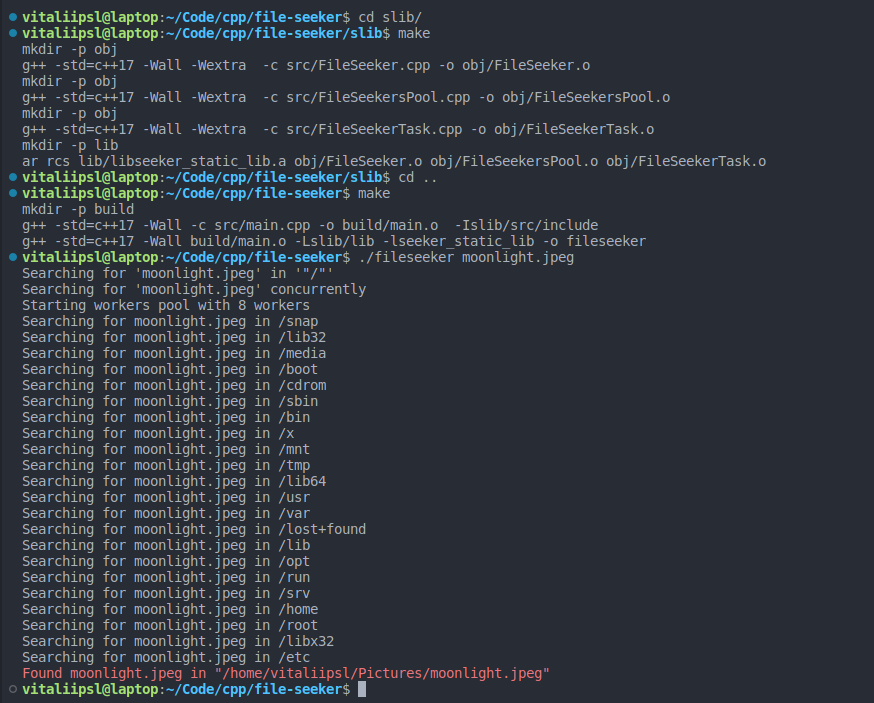

## File Seeker

### How to Run

To use File Seeker, follow these steps:

1. First, build the static library by executing the following commands:

   ```
   cd slib
   make
   ```

2. After building the static library, compile the code from the sources and link it with the static library. Follow these steps:

   ```
   cd ..
   make
   ```

3. Now, you will find an executable named `fileseeker` in the project root. Run it with the following command:

   ```
   ./fileseeker <filename> [optionally starting directory]
   ```

   Replace `<filename>` with the name of the file you want to search for. You may also provide an optional starting directory to narrow down the search scope.

Please note that this guide assumes you have a working `makefile`

### Example 
